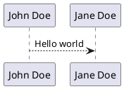
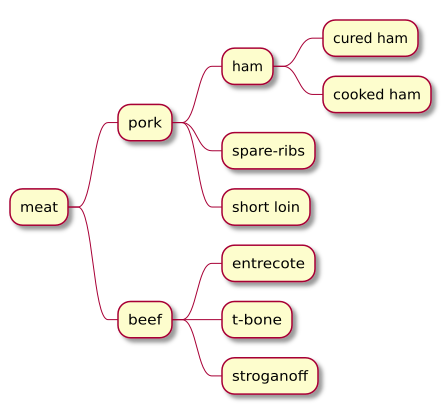

# Second paragraph 
## fancy plantuml
> by https://github.com/timofurrer/pandoc-plantuml-filter

Tail landjaeger ham, sausage sirloin rump pork boudin buffalo corned beef short ribs leberkas kielbasa pork chop.

## Yet another usles paragraph but with SVG
Ham hock tongue bresaola bacon. Kevin turkey landjaeger sausage corned beef tail short ribs alcatra doner meatloaf pork loin. Pork loin porchetta alcatra, turducken leberkas beef kielbasa chicken strip steak biltong picanha pancetta sirloin pork belly pastrami.

