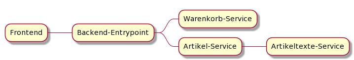

# First Paragraph 
## A sub paragraph
Bacon ipsum dolor amet cupim bresaola corned beef leberkas pork belly pastrami. Meatball ribeye turducken pork chop bresaola, t-bone sirloin turkey ham flank. Leberkas meatball ribeye pancetta beef ham spare ribs. Flank capicola brisket hamburger filet mignon beef doner frankfurter pork pig ham. [@fig:img-label]


{#fig:img-label}


## Another sub paragraph
Ham hock tongue bresaola bacon. Kevin turkey landjaeger sausage corned beef tail short ribs alcatra doner meatloaf pork loin. Pork loin porchetta alcatra, turducken leberkas beef kielbasa chicken strip steak biltong picanha pancetta sirloin pork belly pastrami.

## Sub paragraph with list and code
Verteilte Transparenz ist wenn sich ein System auf verschiedenen Maschinen befindet, dies für den User allerdings _Transparent_ also nicht ersichtlich ist.

- Leberkas 
- pork flank
- short loin
- meatball
- capicola

```kotlin
fun pancetta() {
  if (pork) {
    return "spare-ribs"  
  }
}
```

